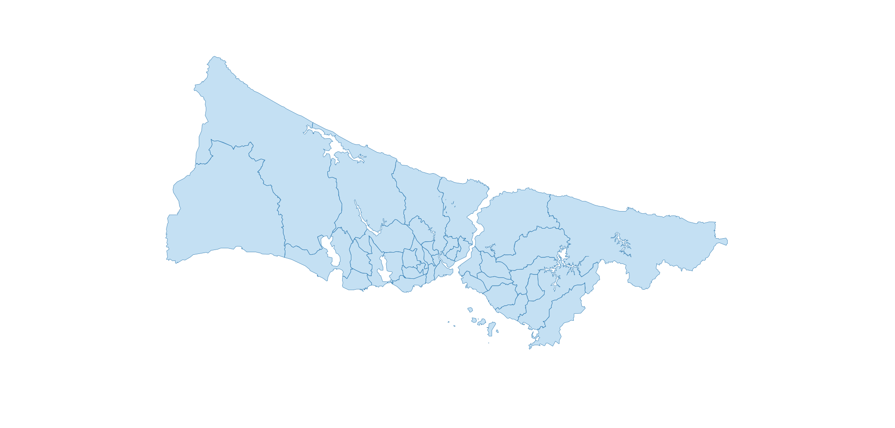

# SVG
Miscellaneous SVG files for projects

## How to convert PNG?
You can use [svgexport](https://github.com/shakiba/svgexport) project to convert SVG files to PNG.

## İstanbul Belediye Logoları

Contains logos for İstanbul municipalities.

## İstanbul İlçeleri SVG
Contains boundaries for İstanbul districts.
