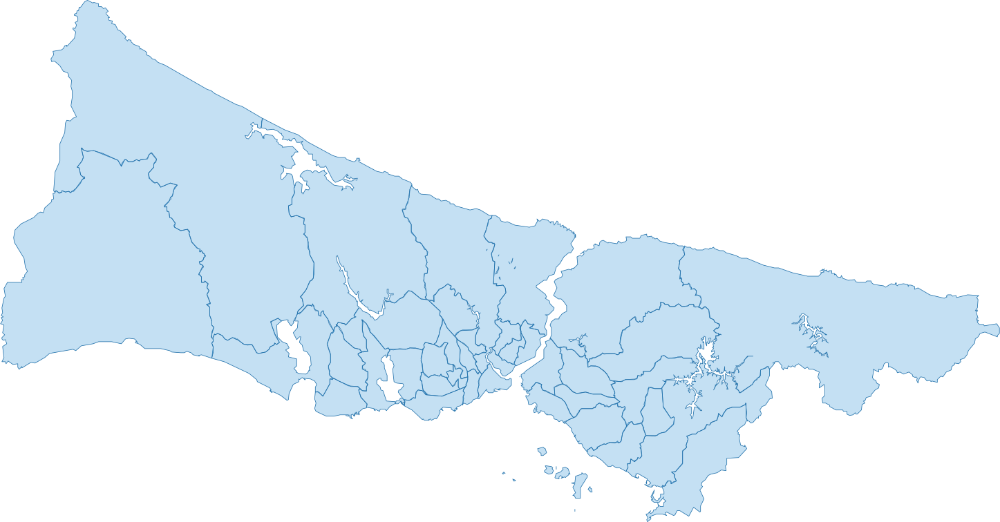

# SVG
Miscellaneous SVG files for projects

## How to convert PNG?
You can use [svgexport](https://github.com/shakiba/svgexport) project to convert SVG files to PNG.

## İstanbul Belediye Logoları
Contains logos for İstanbul municipalities.

## İstanbul İlçeleri SVG
Contains boundaries for İstanbul districts.

## Special Thanks
[SpriteSheetPacker](https://github.com/nickgravelyn/SpriteSheetPacker) for creating image map.

## License
This project is available under the MIT license. See the LICENSE file for more info.